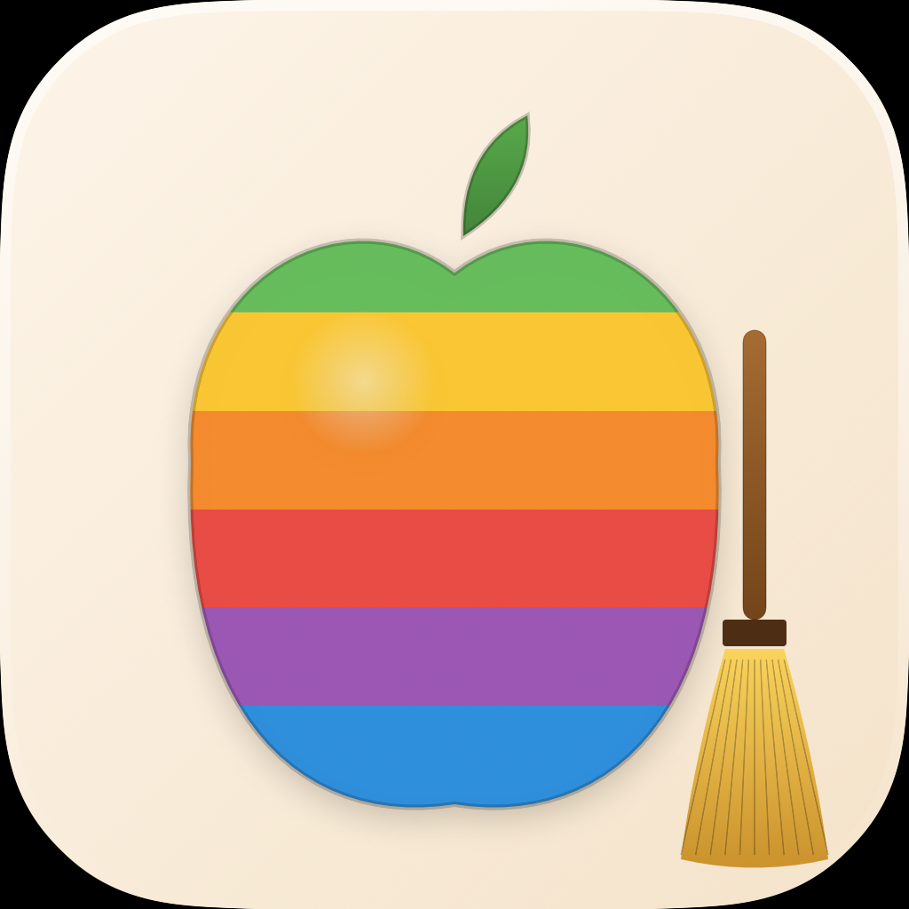

<p align="center">
  
</p>

<h1 align="center">MacBroom</h1>

<p align="center">
  A free, open-source Mac cleanup app — rainbow stripes, a tiny broom, zero paywall.<br />
  <em>Built because CleanMyMac shouldn't cost €35/year for stuff macOS could do itself.</em>
</p>

<p align="center">
  <a href="https://github.com/ijuanlux/macbroom/releases/latest">
    
  </a>
  <a href="LICENSE">
    
  </a>
  
  
</p>

---

## Features

| | |
| --- | --- |
| **Dashboard** | One-click Smart Scan, storage breakdown, lifetime stats |
| **Caches** | Scans `~/Library/Caches` and Logs, groups by app with real icons |
| **Dev Junk** | Xcode DerivedData / Docker / npm / pip / cargo / gradle / maven / Homebrew / Carthage / CocoaPods |
| **Uninstaller** | Lists `/Applications` apps with their leftovers in `~/Library/*`, removes both. Quits running apps, asks for admin password when needed |
| **Large Files** | Finds files >100 MB in Downloads, Documents, Desktop, Movies |
| **Duplicates** | SHA-256 hashing finds identical files, "keep newest" auto-selects trash candidates |
| **Privacy** | Cookies, history, cache databases for Safari, Chrome, Brave, Firefox, Edge, Arc |
| **Mail & Old Downloads** | Local mail attachments + files in Downloads older than 30 days |
| **Memory** | Live RAM stats (active / wired / compressed / inactive / free) + one-click `purge` |
| **Maintenance** | Flush DNS, rebuild Spotlight, verify disk, clear font caches, reset Launchpad, force-empty Trash, restart Dock/Finder |
| **Disk Explorer** | Treemap visualization à la DaisyDisk, click-to-drill, any folder |
| **Startup** | Lists LaunchAgents and LaunchDaemons, toggle user-level ones |
| **Hacker Mode** | A full terminal-style view with Matrix rain, ASCII art, live system stats. Plus a global "Hacker theme" toggle that turns the whole UI green-on-black monospace |
| **Menu bar widget** | Live disk + RAM percentages, Smart Scan and Free RAM right from the menu bar |
| **Command palette** | Cmd+K opens a fuzzy-searchable action launcher |
| **Notifications** | Optional low-disk alerts |
| **Settings** | Light/Dark/Hacker theme, hide tiny items, hide Apple system caches, disk-watcher threshold |

## Screenshots

> Drop screenshots at `docs/screenshots/` and they will render here.

| Dashboard | Hacker Mode | Disk Explorer |
| :---: | :---: | :---: |
| `docs/screenshots/dashboard.png` | `docs/screenshots/hacker.png` | `docs/screenshots/explorer.png` |

## Build from source

Requires macOS 14 (Sonoma) or later and Xcode 15+.

```bash
# clone
git clone https://github.com/ijuanlux/macbroom.git
cd macbroom

# project is generated from project.yml — install xcodegen once
brew install xcodegen
xcodegen generate

# open in Xcode or build from CLI
open MacBroom.xcodeproj
# or
xcodebuild -project MacBroom.xcodeproj -scheme MacBroom -configuration Release build
```

The retro icon is generated procedurally:

```bash
swift Tools/generate_icon.swift
```

## How it removes files

- All deletions go to the system Trash. Nothing is `rm`-ed.
- For `~/Library/*` items (user-owned) it uses `NSWorkspace.recycle` — instant, no prompt.
- For `/Applications` items (root-owned) it falls back to AppleScript via Finder, which pops the standard macOS admin password dialog. Same flow as dragging the app to the Trash yourself.

## Safety

- App is not sandboxed (otherwise it couldn't read `~/Library`).
- It does not collect telemetry, analytics, or check for updates.
- All scan + clean operations are local. No network calls except for the auto-update check (when implemented — currently disabled).
- Open source — read `MacBroom/Services/*.swift` to audit what gets touched.

## Roadmap

- [ ] Notarized DMG distribution
- [ ] Auto-update via Sparkle
- [ ] Mail.app rules cleanup
- [ ] Photo library "similar" finder
- [ ] Plugin system so the community can add scanners

## License

MIT. See [LICENSE](LICENSE). Use it, fork it, ship it.

## Credits

Built with Swift + SwiftUI on macOS. Icon hand-coded in SwiftUI shapes (`MacBroom/Design/AppIconView.swift`). The rainbow-stripe apple is an homage to the classic 1977–1998 Apple logo, redrawn here so the silhouette and leaf are distinct from Apple's trademark.
